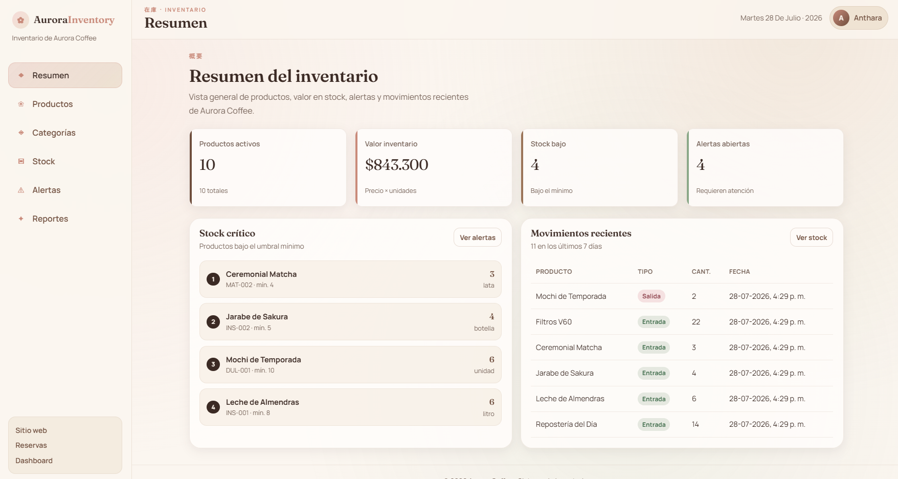
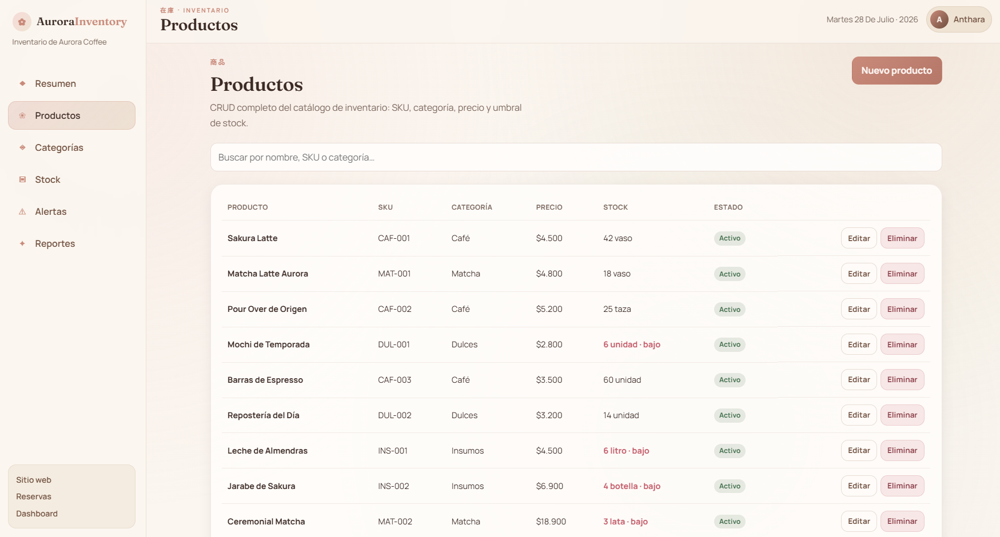
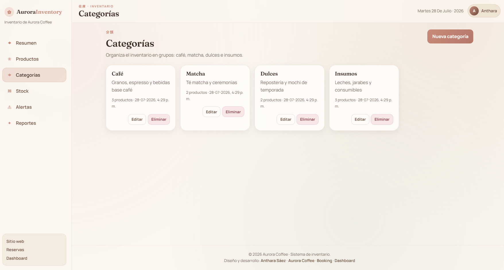
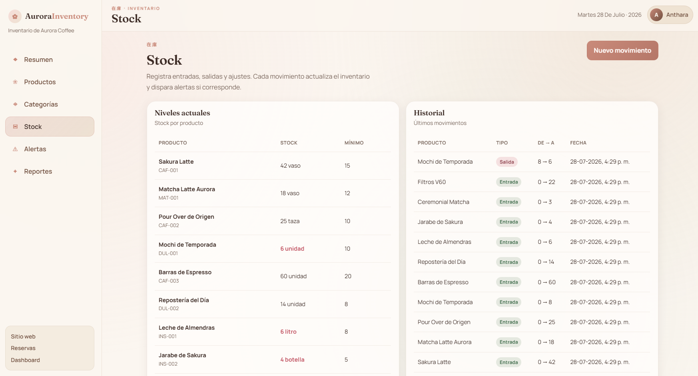
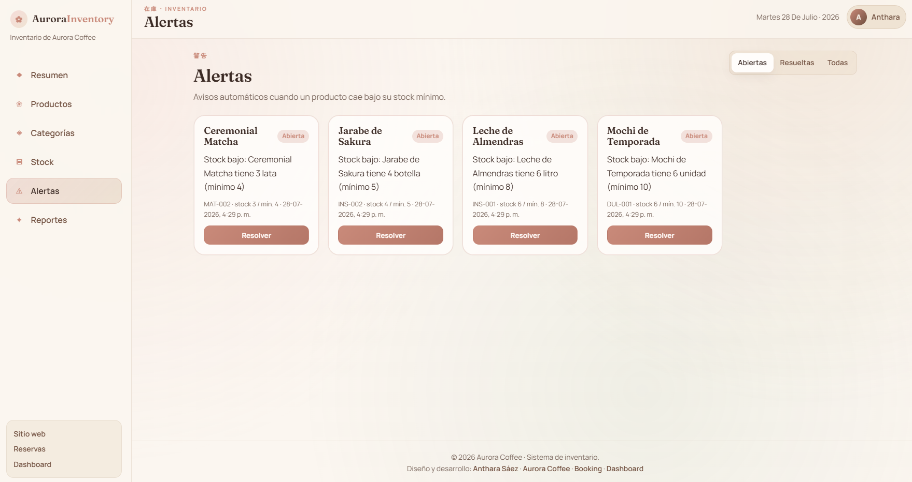
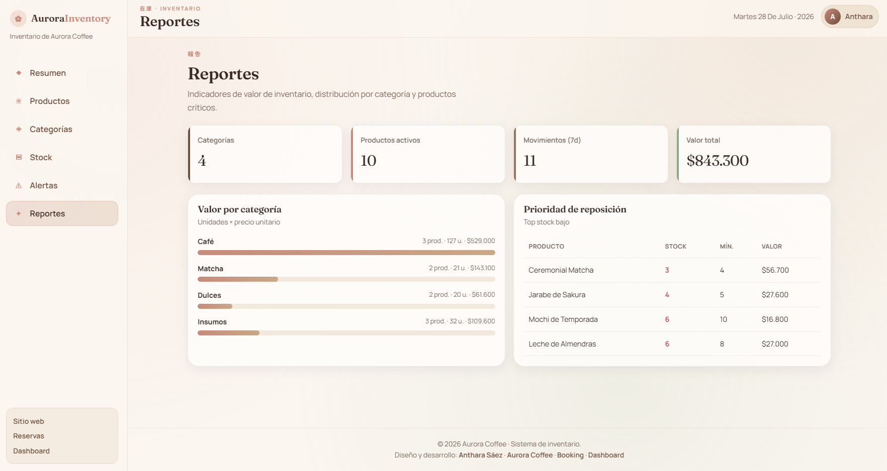

# 📦 Aurora Inventory


Sistema de inventario full-stack para **Aurora Coffee**, con estética japonesa cálida (beige, café y sakura), API REST en Spring Boot y panel en React.

---

## 📖 Descripción

**Aurora Inventory** es el sistema de inventario de [Aurora Coffee](https://aurora-coffee-bay.vercel.app/), una cafetería ficticia de inspiración japonesa ubicada en Punta Arenas, Chile.

El proyecto forma parte de mi portafolio profesional y demuestra habilidades en **React**, **Spring Boot**, **MySQL**, diseño de APIs REST, CRUD completo y coherencia de marca con el ecosistema Aurora (Coffee + Booking + Dashboard).

---

## 🎯 Objetivo

Crear un sistema de inventario que permita:

- Administrar productos con SKU, precio, stock y umbral mínimo.
- Organizar el catálogo en categorías.
- Registrar entradas, salidas y ajustes de stock.
- Recibir alertas automáticas cuando el stock baja del mínimo.
- Consultar reportes de valor y distribución del inventario.
- Mantener la misma tipografía, logo y colores que Aurora Coffee.

---

## ✨ Funcionalidades

- Diseño responsive para móviles, tablets y escritorio.
- Panel resumen con KPIs (productos activos, valor, stock bajo, alertas).
- CRUD completo de productos y categorías.
- Movimientos de stock (entrada, salida y ajuste) con historial.
- Alertas de stock bajo abiertas / resueltas.
- Reportes por categoría y prioridad de reposición.
- Datos semilla alineados al menú de Aurora Coffee (precios en CLP).
- Persistencia real con MySQL (y perfil H2 para desarrollo rápido).
- Identidad visual compartida (Fraunces, Zen Maru Gothic, Manrope).
- Enlaces a Aurora Coffee, Booking y Dashboard.
- Footer con crédito de autora.

---

## 🛠 Tecnologías

- React 19.
- JavaScript (ES Modules).
- Vite.
- CSS3 moderno (Grid y Flexbox).
- date-fns.
- Spring Boot 4.
- Spring Data JPA.
- Validation.
- MySQL 8.
- H2 (perfil de desarrollo).
- Docker Compose (opcional para MySQL).
- Google Fonts: Fraunces, Zen Maru Gothic y Manrope.
- Maven Wrapper.

---

## 📂 Estructura del proyecto

```text
aurorainventory/
├── assets/
│   ├── banner.png
│   ├── captura-resumen.png
│   ├── captura-productos.png
│   ├── captura-categorias.png
│   ├── captura-stock.png
│   ├── captura-alertas.png
│   └── captura-reportes.png
├── backend/
│   ├── src/main/java/com/aurora/inventory/
│   │   ├── config/
│   │   ├── controller/
│   │   ├── domain/
│   │   ├── dto/
│   │   ├── exception/
│   │   ├── repository/
│   │   ├── service/
│   │   └── AuroraInventoryApplication.java
│   ├── src/main/resources/
│   │   ├── application.properties
│   │   ├── application-h2.properties
│   │   └── application-mysql.properties
│   ├── mvnw
│   ├── mvnw.cmd
│   └── pom.xml
├── frontend/
│   ├── public/
│   ├── src/
│   │   ├── api/
│   │   │   └── client.js
│   │   ├── components/
│   │   │   ├── pages/
│   │   │   │   ├── AlertsPage.jsx
│   │   │   │   ├── CategoriesPage.jsx
│   │   │   │   ├── DashboardPage.jsx
│   │   │   │   ├── ProductsPage.jsx
│   │   │   │   ├── ReportsPage.jsx
│   │   │   │   └── StockPage.jsx
│   │   │   ├── Footer.jsx
│   │   │   ├── KpiCard.jsx
│   │   │   ├── Modal.jsx
│   │   │   ├── PageHeader.jsx
│   │   │   ├── Sidebar.jsx
│   │   │   ├── StatusBanner.jsx
│   │   │   └── Topbar.jsx
│   │   ├── utils/
│   │   │   ├── constants.js
│   │   │   └── format.js
│   │   ├── App.css
│   │   ├── App.jsx
│   │   ├── index.css
│   │   └── main.jsx
│   ├── index.html
│   ├── package.json
│   └── vite.config.js
├── docker-compose.yml
├── LICENSE
└── README.md
```

---

## 📸 Capturas de pantalla

### Resumen



### Productos



### Categorías



### Stock



### Alertas



### Reportes



---

## 🚀 Demo

- [Ver repositorio](https://github.com/Nubby01/aurorainventory)
- [Sitio de Aurora Coffee](https://aurora-coffee-bay.vercel.app/)
- [Sistema de reservas (Aurora Booking)](https://aurora-booking-rho.vercel.app/)
- [Panel administrativo (Aurora Dashboard)](https://aurora-dashboard-tawny.vercel.app/)

---

## ⚙ Instalación

### Requisitos

- Java 17+ (probado con Java 25)
- Node.js 20+
- MySQL 8 **o** perfil H2 (sin instalar MySQL)
- Docker (opcional)

Clona el repositorio:

```bash
git clone https://github.com/Nubby01/aurorainventory.git
```

Ingresa al proyecto:

```bash
cd aurorainventory
```

### Backend

```bash
cd backend
.\mvnw.cmd spring-boot:run
```

Por defecto usa **H2** en memoria y carga datos de demostración.

API disponible en `http://localhost:8080`.

#### MySQL

Crea la base y el usuario:

```sql
CREATE DATABASE aurora_inventory CHARACTER SET utf8mb4 COLLATE utf8mb4_unicode_ci;
CREATE USER 'aurora'@'localhost' IDENTIFIED BY 'aurora123';
GRANT ALL PRIVILEGES ON aurora_inventory.* TO 'aurora'@'localhost';
FLUSH PRIVILEGES;
```

O con Docker:

```bash
docker compose up -d
```

Luego inicia el backend con perfil MySQL:

```bash
.\mvnw.cmd spring-boot:run "-Dspring-boot.run.profiles=mysql"
```

Credenciales por defecto (`application-mysql.properties`):

- Host: `localhost:3306`
- Base de datos: `aurora_inventory`
- Usuario: `aurora`
- Contraseña: `aurora123`

### Frontend

```bash
cd frontend
npm install
npm run dev
```

Luego visita `http://localhost:5173`.

Para generar el build de producción:

```bash
npm run build
npm run preview
```

---

## 📅 Roadmap

- [x] CRUD de productos.
- [x] CRUD de categorías.
- [x] Movimientos de stock (entrada, salida, ajuste).
- [x] Alertas automáticas de stock bajo.
- [x] Reportes y panel resumen.
- [x] Diseño responsive e identidad Aurora Coffee.
- [x] Integración con MySQL.
- [ ] Autenticación de administradores.
- [ ] Roles (admin / bodega / gerente).
- [ ] Exportación de reportes (CSV / PDF).
- [ ] Despliegue en la nube (API + frontend).

---

## 🧪 Futuras mejoras

- Autenticación JWT y control de acceso por roles.
- Multialmacén y transferencias entre bodegas.
- Notificaciones por correo o WhatsApp ante stock crítico.
- Exportación e impresión de reportes.
- Tests unitarios e integración (JUnit + Vitest).
- Conectar inventario en vivo con Aurora Booking y el Dashboard.
- Modo multiidioma (ES / EN / JA).
- Optimizar imágenes a WebP o AVIF.

---

## 👩‍💻 Autora

**Anthara Sáez**

Estudiante de Ingeniería en Informática y fundadora de **SaezTecnology**.

- [GitHub](https://github.com/Nubby01)
- [LinkedIn](https://www.linkedin.com/in/anthara-delgado-s%C3%A1ez-b9350a423/)

---

## 📄 Licencia

Este proyecto se distribuye bajo la [licencia MIT](LICENSE). Puedes utilizarlo, modificarlo y compartirlo respetando sus términos.
